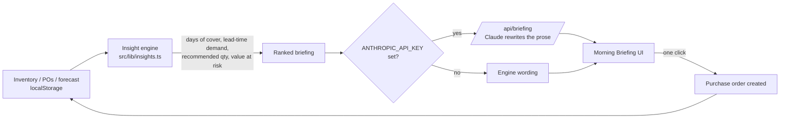

# ChainSight

**An inventory and supply-chain command center that reads your stock position
the moment you open it, works out what is about to go wrong, and drafts the
fix.**

Live demo → _add your Vercel URL here_  ·  Open source under the
[MIT License](LICENSE)  ·  Built by **Vikesh Sagar Bairam**

---

## The problem

In most operations a stockout is discovered when someone tries to fulfil an
order and the shelf is empty — by which point the supplier lead time has
already run out. The signals were all there (demand climbing, stock falling,
reorder point close); nobody was watching every SKU every day.

## The idea

Don't make the manager read a dashboard. When they open the app, **the
analysis is already done**: every SKU scored, the risks ranked, the purchase
orders drafted. The manager reads a short briefing and clicks to act.

## How it works



- **The engine is deterministic and owns every number.** Stockout-vs-lead-time
  math, severity ranking, recommended order quantity, value of demand at risk,
  and a templated narrative summary. Runs with zero configuration and no API
  key.
- **Optional LLM narration.** If `ANTHROPIC_API_KEY` is set, a server route
  (`/api/briefing`) asks a model to rewrite only the _wording_ — the figures
  and recommendations never leave the engine. Without the key the app is fully
  functional at no cost.
- **One connected loop.** A reorder from the briefing becomes a purchase order;
  a received PO or a completed production order updates stock; the next
  briefing reflects it.

## Modules

| Route | What it does |
|-------|--------------|
| `/` | Public landing / about page |
| `/dashboard` | **Morning Briefing** — ranked risk alerts, executive summary, one-click reorders |
| `/inventory` | Every SKU: stock, forecast, reorder point, lead time, live risk rating |
| `/demand-forecast` | 7 / 30 / 60 / 90-day demand signals, trend detection, planning recommendations |
| `/suppliers` | On-time delivery, quality score, defect rate, lead time |
| `/purchase-orders` | Procurement lifecycle, draft → received (receiving updates inventory) |
| `/production` | **Production & Quality** — manufacturing orders, first-pass yield, defect rate, quality holds (completed orders flow good units into inventory) |

## Engineering notes

- **Deterministic core, optional AI.** The interesting decision: keep all
  arithmetic and recommendations in plain TypeScript that is testable and free
  to run, and treat the language model as a presentation layer that can be
  swapped out or turned off. `AiBriefing` renders an instant local result, then
  replaces it with the narrated version when the API responds — the UI never
  blocks on the network.
- **Event-driven cross-module sync.** Modules communicate through a browser
  `inventory-updated` event and a shared `localStorage` layer, so the briefing
  recomputes the moment stock changes anywhere in the app.
- **Data model** in `frontend/src/data/*` — one module per domain object
  (`inventory`, `purchaseOrders`, `production`) with typed load/save helpers.

## Tech stack

Next.js 16 (App Router, Turbopack) · React 19 · TypeScript · Tailwind CSS v4 ·
Recharts · Sonner · optional `@anthropic-ai/sdk` · deployed on Vercel.

## Run locally

```bash
cd frontend
npm install
npm run dev            # http://localhost:3000
```

For AI-narrated briefings, copy `frontend/.env.example` to
`frontend/.env.local` and set `ANTHROPIC_API_KEY`.

## Deploy

The app is in `frontend/`. On Vercel set **Root Directory** to `frontend`
(framework preset: Next.js). No environment variables are required.

## Roadmap

This is an early public build. Data is currently per-browser (`localStorage`)
with seed data — a showcase, not yet multi-user.

- [ ] Auth + a database (per-account data)
- [ ] Caching + rate limiting on `/api/briefing` before a shared API key
- [ ] Charts across every module
- [ ] Unit tests on the insight engine + a Playwright smoke test in CI
- [ ] CSV import for real inventory

## About the builder

**Vikesh Sagar Bairam** — I built ChainSight end to end: the analysis engine,
the interface, the data model and the deployment.

**Open to opportunities** — full-stack / product engineering roles,
founding-engineer work, and collaborations with teams building operational
software.

- GitHub: <https://github.com/Vikesh2608>
- LinkedIn: _add link_
- Email: _add address_

## License

[MIT](LICENSE) © 2026 Vikesh Sagar Bairam
